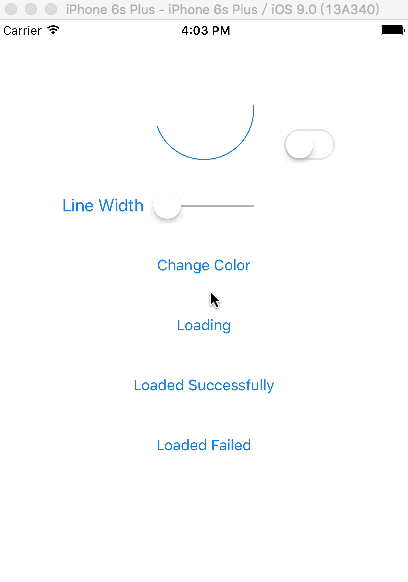

# CPLoading

CPLoading shows loading process and completes successfully or unsuccessfully in the animation. 

Inspired by the excellent [MMMaterialDesignSpinner](https://github.com/misterwell/MMMaterialDesignSpinner)

###Screenshot 



## Installation

### Manually

The simplest way to install this library is to copy `Classes/CPLoadingView.swift` to your project.

### CocoaPods

You can also install this library using CocoaPods. Just add this line to your Podfile:

```ruby
pod 'CPLoadingView'
```

Then import library module like so:

```swift
import CPLoadingView
```
## Usage

start loading
```swift
startLoading()
``` 

complete loading successfully
```swift
completeLoading(true)
``` 

complete loading unsuccessfully
```swift
completeLoading(false)
``` 

## Properties

```swift
var lineWidth: CGFloat = 1.0
```

The line width of path of view.

```swift
var strokeColor: UIColor = UIColor(red: 0.0, green: 122.0/255.0, blue: 1.0, alpha: 1.0)
```

The stroke color of path of view.

```swift
var hidesWhenCompleted: Bool = false
```

Whether to hide view when loading completed

## Requirements
* Swift 2.0
* Xcode 7


## License
Released under the MIT license. See LICENSE for details.