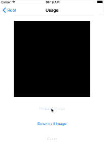
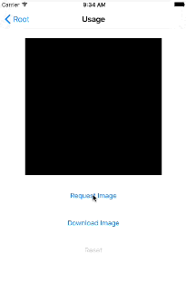

# CPLoading

CPLoading shows loading, progress and completion in the animation. 

Inspired by the excellent [MMMaterialDesignSpinner](https://github.com/misterwell/MMMaterialDesignSpinner)

## Screenshot

##### Loaded successfully




##### Loaded unsuccessfully



## Installation

### Manually

The simplest way to install this library is to copy `Classes/CPLoadingView.swift` to your project.

### CocoaPods

You can also install this library using CocoaPods. Just add this line to your Podfile:

``` ruby
pod 'CPLoadingView'
```

Then import library module like so:

``` swift
import CPLoadingView
```

## Properties

``` swift
var lineWidth: CGFloat = 2.0
```

The line width of path of view.

``` swift
var strokeColor: UIColor = UIColor(red: 0.0, green: 122.0/255.0, blue: 1.0, alpha: 1.0)
```

The stroke color of path of view.

``` swift
var fontSize: Float = 30
```

The font size of progress

``` swift
var hidesWhenCompleted: Bool = false
```

Whether to hide view when loading completed

``` swift
var hidesAfterTime: NSTimeInterval = 0.5
```

The delay time to hide view

## Usage

Start loading

``` swift
loadingView.startLoading()
```

Set progress

``` swift
loadingView.progress = 0.5
```

Complete loading successfully

``` swift
loadingView.completeLoading(success: true)
```

Complete loading unsuccessfully

``` swift
loadingView.completeLoading(success: false)
```

## Requirements

* Swift 3.0+
* Xcode 8.0+

## License

Released under the MIT license. See LICENSE for details.